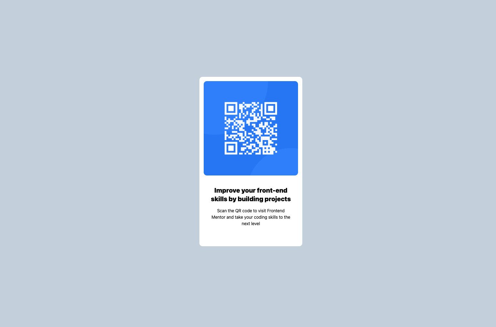
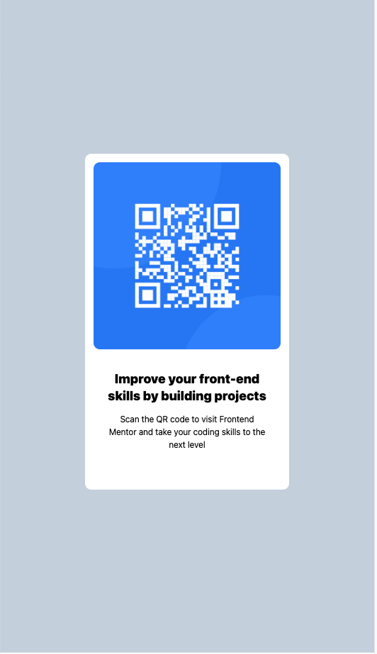

# Frontend Mentor - QR code component solution

This is a solution to the [QR code component challenge on Frontend Mentor](https://www.frontendmentor.io/challenges/qr-code-component-iux_sIO_H).

## Table of contents

- [Overview](#overview)
  - [Screenshot](#screenshot)
  - [Links](#links)
- [My process](#my-process)
  - [Built with](#built-with)
  - [What I learned](#what-i-learned)
  - [Continued development](#continued-development)
  - [Useful resources](#useful-resources)
- [Author](#author)
- [Acknowledgments](#acknowledgments)

## Overview

This is a QR code component project that allows users to scan a QR code to visit a specified website or resource.

It was built as my first coding challenge from Frontend Mentor and gave me an opportunity to practice responsive design techniques, improve my HTML/CSS skills, and implement best practices in web development.

The component is built to be responsive and to adjust seamlessly across different screen sizes.

### Screenshot

### Links

- Solution URL: [Add solution URL here](https://github.com/CarmenGas/challenge-projects)
- Live Site URL: [Add live site URL here](https://CarmenGas.github.io/challenge-projects/)

## My process

1. Understanding the Design

I began by reviewing the Figma design assets provided by Frontend Mentor. Initially, I found it challenging to interpret the structure and style requirements, which motivated me to research other developers' solutions to the same project on the platform.

2. Planning the Layout

With some inspiration and perspective gained, I sketched a rough structure for the HTML layout, ensuring semantic and accessible tags were used.

3. Coding the HTML

I focused on creating a clean, semantic HTML structure to ensure the content was easy to understand and accessible.

4.  Using CSS, I worked on the visual styling and responsiveness. I converted fixed pixel measurements to rem units for better scalability and included media queries to handle different screen sizes.

5.  Testing Responsiveness

I used browser developer tools to simulate various screen sizes and tweaked the design to ensure it looked good across devices.

6. Refinements

After completing the initial design, I revisited the project to refine areas such as spacing, typography, and alignment to match the design as closely as possible.

### Built with

- Tailwind v3.4.0
- CSS custom properties
- Flexbox
- CSS Grid
- Mobile-first workflow

### What I Learned

---

While it is true that I still have a whole lot to learn, this project helped me deepen my understanding of the following concepts:

- **Responsive Design:** Through this project, I was introduced to the 'mobile-first' design principle. Even though not fully implemented in this project I've learned how important it is going forward to approach layouts in modern web development with this mindset and effectively use media queries with relative units like rem to ensure responsiveness.

- **CSS Flexbox:** I gained hands-on experience with Flexbox for aligning and positioning elements within the card layout.

- **Unit Conversion:** Converting fixed pixel values to rem improved the scalability and accessibility of my design.

- **Working with Figma design files:** I gained some understanding on how to use a design file and saw for the first time how the details they provide can really improve the work flow.

- **Markdown for Documentation:** I became familiar with how the sections of a README.md file is structured and linked for clear project documentation.

### Continued Development

---

While I am happy with the current state of this project, there are areas I would like to continue improving. In the future, I'd like to:

- **JavaScript Integration:** Add interactivity to components like this one, such as animating the QR code or showing a tooltip on hover. This is why I am working hard on learning Javascript.

- **Accessibility Enhancements:** Explore using ARIA roles and landmarks more effectively to make projects more accessible for screen readers.

- **Scalable Design Patterns:** Learn more about CSS Grid and compare its use cases to Flexbox for even more dynamic layouts. Also explore further and improve on using the mobile-first principle as best practice.

- **Additional Features:** Add a dark mode toggle and style adjustments for improved user experience.

## Useful resources

- [Conquering Responsive Layouts](https://courses.kevinpowell.co/conquering-responsive-layouts) - This is an amazing video course which helped me begin to gain valuable insight on this subject that before now really confused me. I'd recommend it to anyone still learning this concept.

- [Example resource 2](https://www.example.com) - This is an amazing article which helped me finally understand XYZ. I'd recommend it to anyone still learning this concept.

## Author

- Frontend Mentor - [@CarmenGas](https://www.frontendmentor.io/profile/CarmenGas)
- Discord - [@ca16rg03](https://discord.com/channels/@ca16rg03)

## Acknowledgments

I want to extend my gratitude to the amazing community on Frontend Mentor. Reviewing the solutions of other developers was invaluable in helping me gain clarity and perspective for this project.
